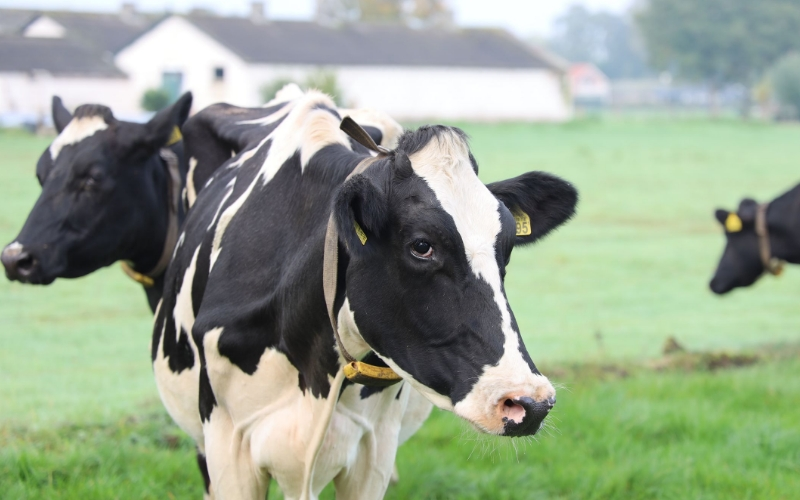

***

Mastitis is one of the most important diseases affecting dairy
cows. Reports from previous research
have shown that organic farms have an increased prevalence
of Staphylococcus aureus-intramammary infections (IMI) compared to conventional
dairy farms. However, little information exists about the
dynamics of IMI in early lactation heifers on organic dairies.
Therefore, the overall goal of this observational study was to describe the IMI dynamics of primiparous cows on certified organic farms during early lactation. Specific objectives were to estimate the prevalence and incidence of IMI with microorganisms of interest for udder health; and to describe their persistence in the mammary gland during the first month of lactation.
 
